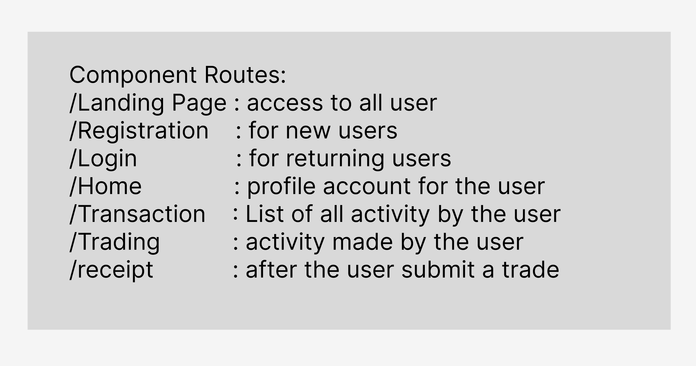
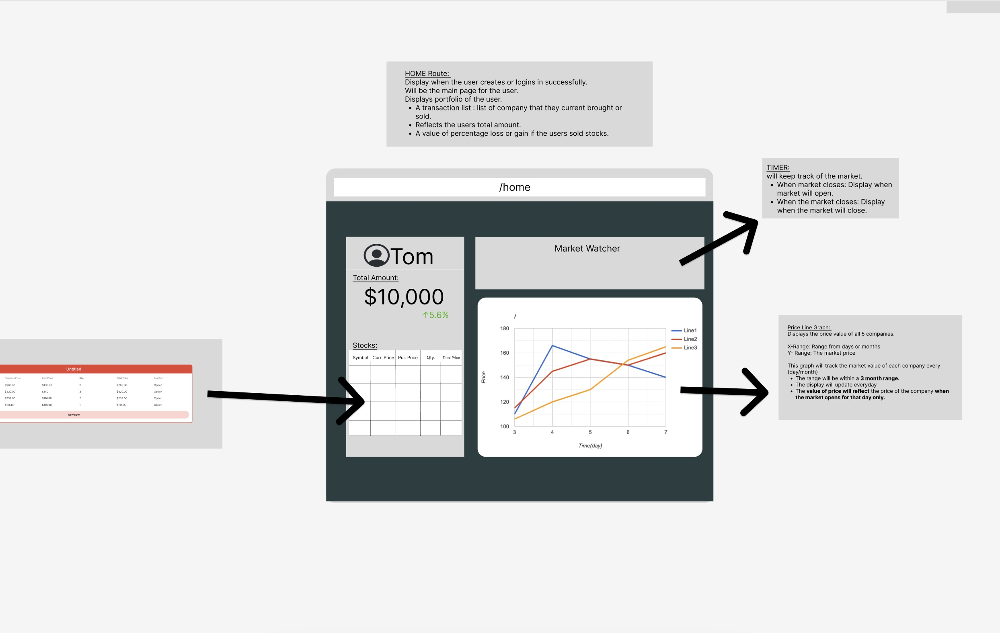
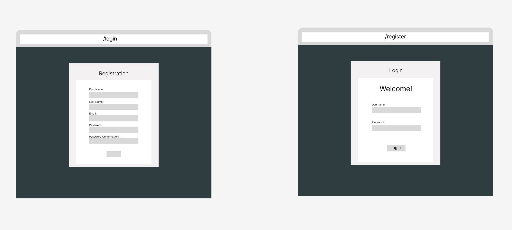
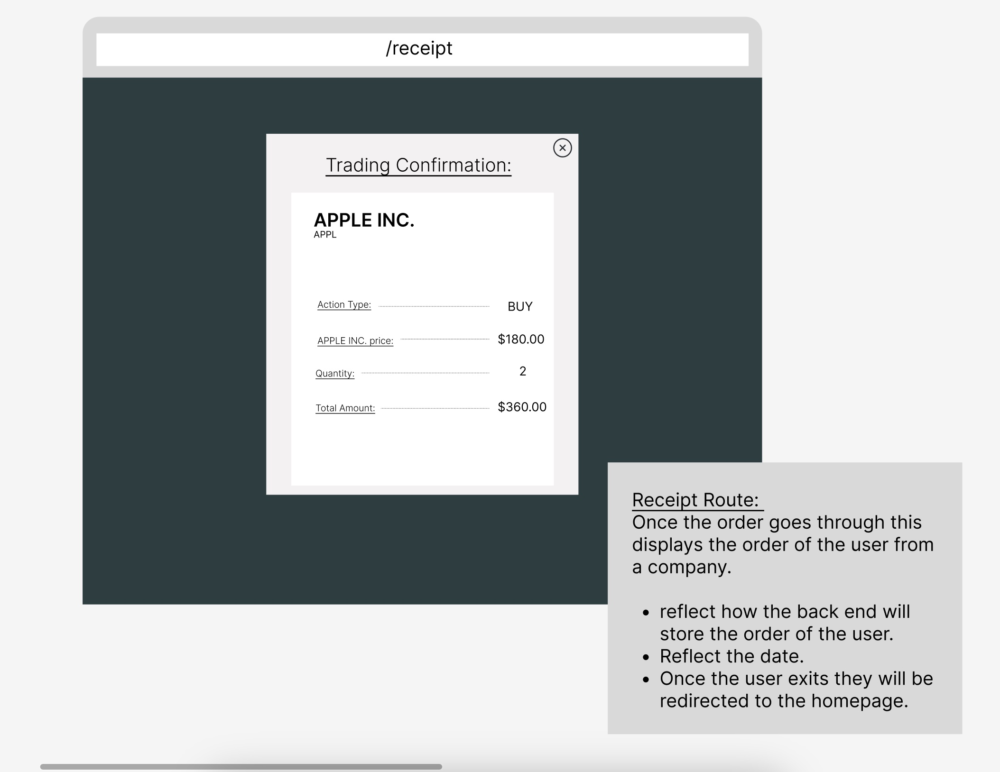
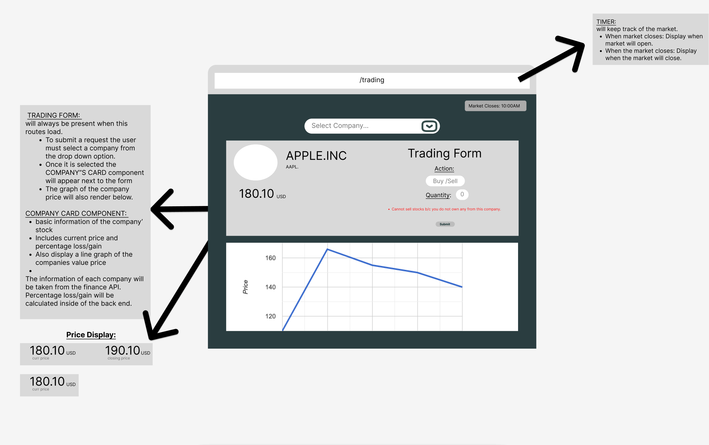

# Project Plan

Pod Members: Matthew Ibrahim, Lake Bradford, Joselyne Malan

## Problem Statement and Description

Our project addresses the lack of understanding and the perception of trading as gambling by providing a user-friendly platform that educates users about investment strategies. We aim to emphasize the quantitative and profit-oriented aspects of trading to empower individuals to make informed investment decisions. Our target audience consists of individuals seeking to learn about responsible investing, including beginners and those interested in quantitative trading approaches.
Our project's primary objective is to provide a secure and risk-free platform that educates users about diverse investment strategies, while dispelling the misconception that trading is synonymous with glorified gambling. Key features include descriptions of multiple trading strategies and their profitibality, and using the current market data to show how effective these strategies are in todays market.
## User Roles and Personas

Include the most up-to-date user roles and personas.

## User Stories

List the current user stories you will implement.

## Pages/Screens

List all the pages and screens in the app. Include wireframes for at least 3 of them.

## Data Model

## Endpoints

List the API endpoints you will need to implement.

Create - POST - Adding a transaction to a table
Update - PUT - Update user's profile data
Read - GET - Fetch the stocks from the Yahoo Finance API

***Don't forget to set up your Issues, Milestones, and Project Board!***
